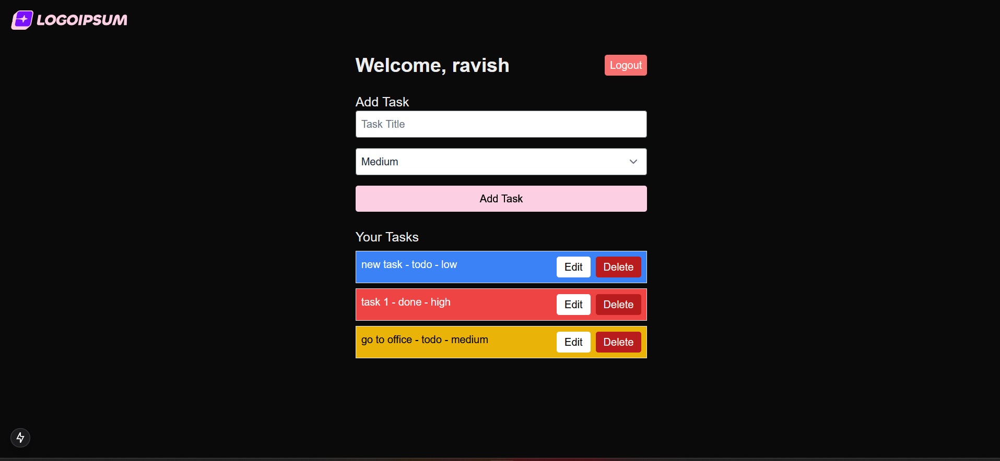

# 📝 Task Manager App  

A full-stack Task Manager application built with **Next.js 14**, **MongoDB**, **NextAuth.js**, and **Tailwind CSS**. It allows users to **create, edit, delete tasks, set reminders, and manage task ownership**.



## 🚀 Tech Stack  
- **Frontend:** Next.js 14 (React, Tailwind CSS)  
- **Backend:** Next.js API Routes, MongoDB (Mongoose)  
- **Authentication:** NextAuth.js (JWT)  
- **Deployment:** Vercel + GitHub Actions (CI/CD)  
- **Testing:** Jest + Playwright  

## 📌 Features  
✅ **User Authentication** (Signup/Login with NextAuth.js)  
✅ **CRUD Operations** (Create, Update, Delete Tasks)  
✅ **Task Ownership** (Users can only manage their own tasks)  
✅ **Optimized Performance** (SSR, SWR, Caching)  

## 🔧 Installation & Setup  
### 1️⃣ Clone the repository  
```bash
git clone https://github.com/yourusername/task-manager.git
cd task-manager
